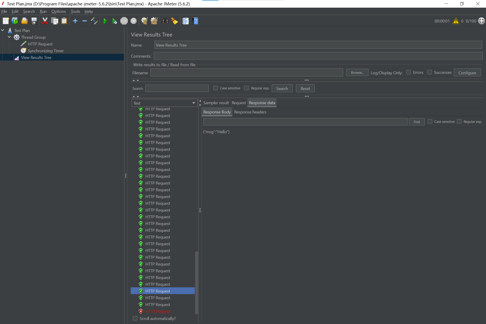

# 2023-基于云原生技术的软件开发-大作业

| 姓名           | 学号      |
| -------------- | --------- |
| 丁思璋（组长） | 211250    |
| 陈泓雨         | 211250012 |
| 王骏佳         | 211250    |

项目地址：https://github.com/wangchunchia/CloudNaive.git

## 作业说明

开发一个 Spring Boot 应用，并使用云原生功能

## 1.功能要求

### 1.实现一个 REST 接口， json 串  {"msg"：“hello”}

- #### 运行截图：


- #### 代码截图：

  service：

  

  domain：

  

  controller（其中包含了限流的实现代码）：

  


### 2.接口提供限流功能，当请求达到每秒 100 次的时候，返回 429

- #### 代码实现：

  限流代码：

  

  抛出异常代码：

  

  

  具体思路为使用Guava实现限流器。

  Google的Guava工具包中提供了一个限流工具类——RateLimiter。RateLimiter是基于“令牌桶算法”来实现限流的。

  RateLimiter的原理类似于令牌桶，它主要由许可发出的速率来定义，如果没有额外的配置，许可证将按每秒许可证规定的固定速度分配，许可将被平滑地分发，若请求超过permitsPerSecond则RateLimiter按照每秒 1/permitsPerSecond 的速率释放许可。

  > #### **令牌桶算法**
  >
  > 令牌桶算法是一个存放固定容量令牌（token）的桶，按照固定速率往桶里添加令牌。令牌桶算法基本可以用下面的几个概念来描述：
  >
  > 1. 假如用户配置的平均发送速率为r，则每隔1/r秒一个令牌被加入到桶中。
  > 2. 桶中最多存放b个令牌，当桶满时，新添加的令牌被丢弃或拒绝。
  > 3. 当一个n个字节大小的数据包到达，将从桶中删除n个令牌，接着数据包被发送到网络上。
  > 4. 如果桶中的令牌不足n个，则不会删除令牌，且该数据包将被限流（要么丢弃，要么缓冲区等待）。

​		由于要求为“达到”每秒一百次，则认为一秒钟最多能通过99次请求，在第100次请求时，返回429。

- #### 运用JMeter进行测试：

  **首先，测试线程数为100时，是否仅有一个线程被限流，返回429。**

  建立线程，定义一个线程数为100、ramp-up时间为1秒、循环次数为1的线程组：

  

  HTTP Request，向http://localhost:8080/发送请求：

  

  计时器：

  

  进行压力测试，发现达到每秒100次后返回429（Too Many Requests）：

  

  正常返回：

  

  控制台输出：

  

​	**然后，测试线程数为110时，是否有十一个线程被限流，返回429。**

建立线程，定义一个线程数为110、ramp-up时间为1秒、循环次数为1的线程组：


测试后，共有十一个线程返回429，符合预期：


## 2. DevOps 要求

### 1.为该项目准备 Dockerfile，用于构建镜像

```dockerfile
# Dockerfile
FROM java:8
RUN ln -sf /usr/share/zoneinfo/Asia/Shanghai /etc/localtime
RUN echo 'Asia/Shanghai' >/etc/timezone
WORKDIR /app
ADD target/cloud-native-project-0.0.1-SNAPSHOT.jar .
ENTRYPOINT ["java","-jar","cloud-native-project-0.0.1-SNAPSHOT.jar"]
```

